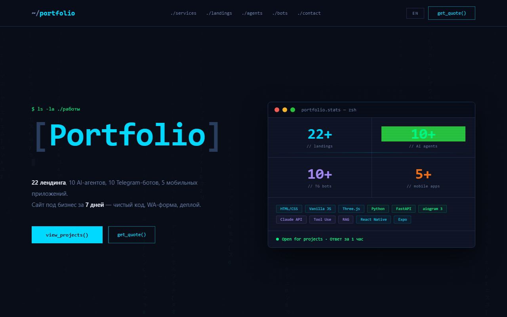
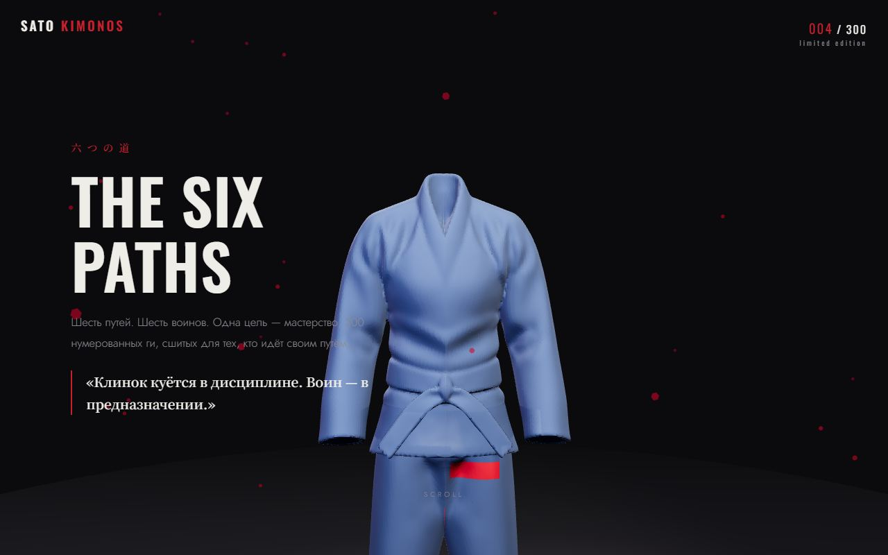
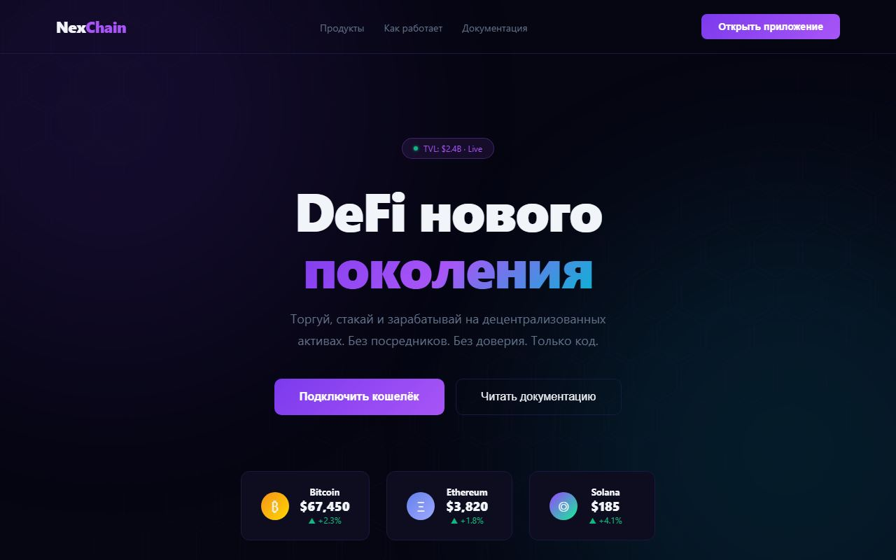
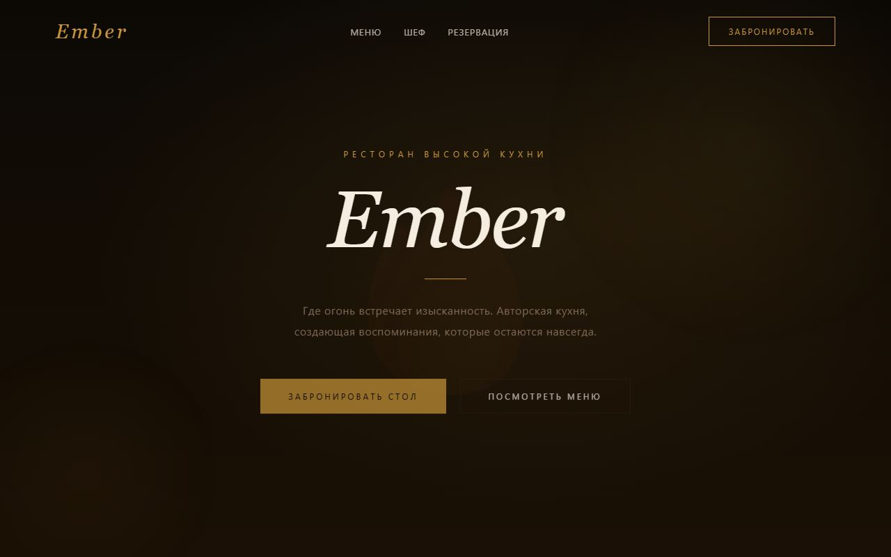
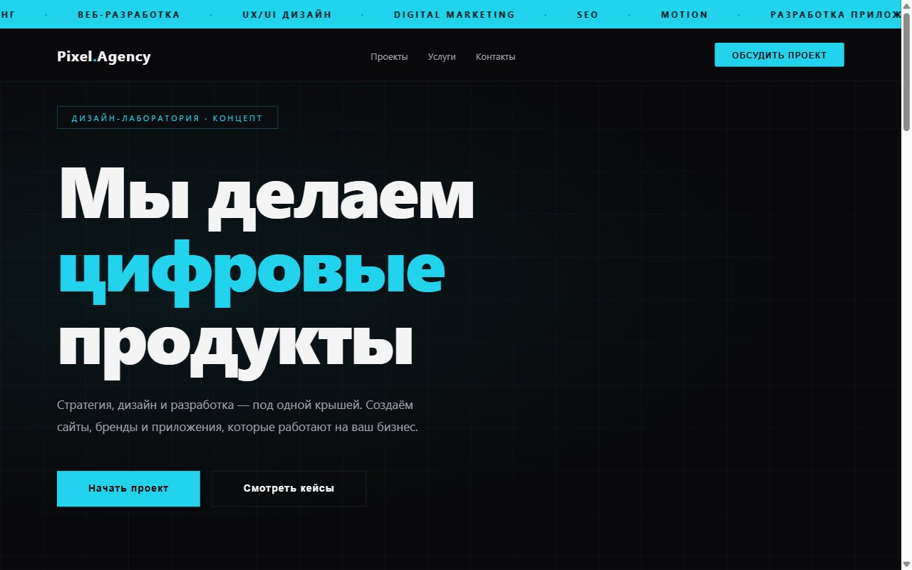
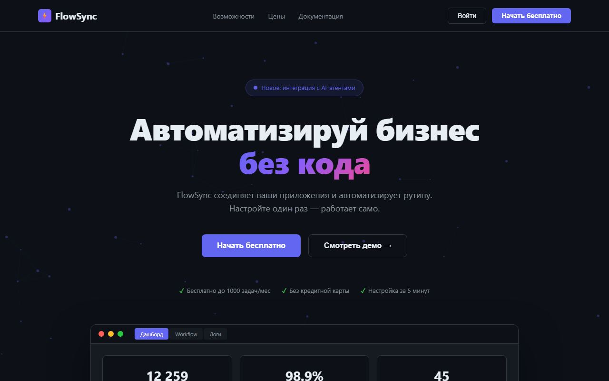
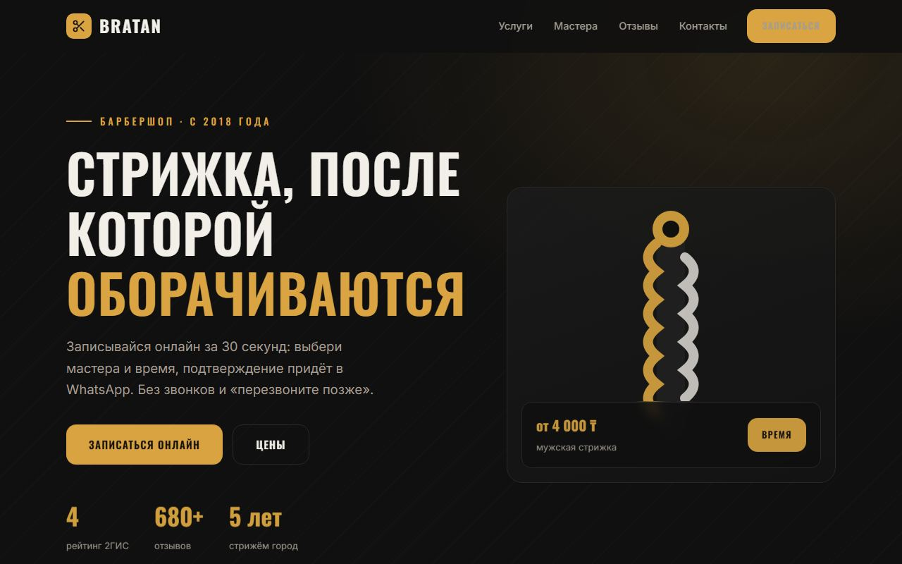
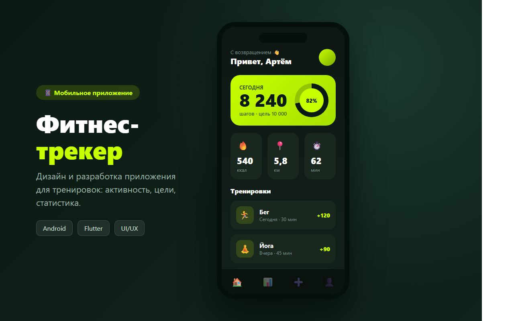
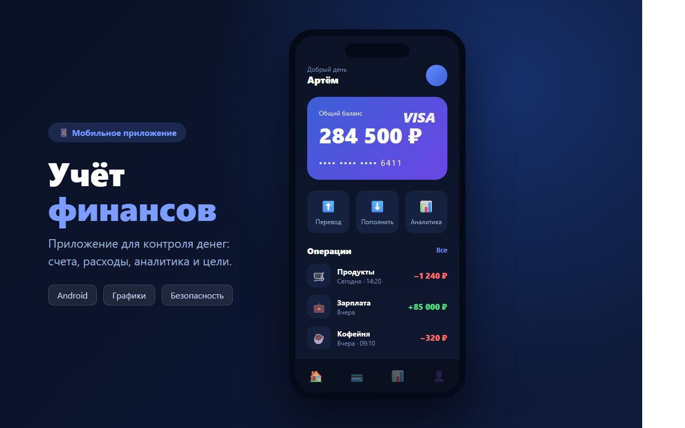
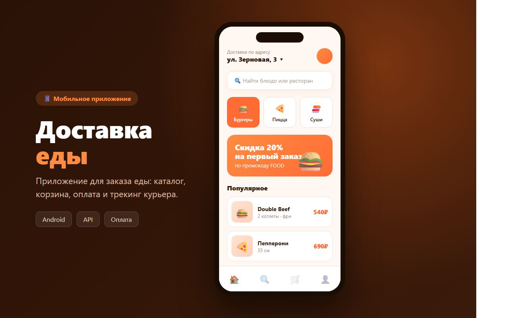

# Портфолио — лендинги, AI-агенты, Telegram-боты и мобильные приложения

**EN:** Portfolio of 49 hand-built projects: 22 responsive landing pages (HTML/CSS/JS, Three.js), 10 Claude-powered AI agents (Python, Tool Use, RAG, FastAPI), 12 Telegram bots (aiogram 3) and 5 React Native / Expo apps. One bot runs live in production. Live showcase: **[artesuavee.github.io/portfolio](https://artesuavee.github.io/portfolio/)**

**49 авторских проектов**: адаптивные лендинги, мобильные приложения на Expo, Python AI-агенты на Claude API и Telegram-боты на aiogram 3. Бот поддержки работает в проде: [@artesuave_support_bot](https://t.me/artesuave_support_bot).

[](https://artesuavee.github.io/portfolio/)

## Живая витрина

**https://artesuavee.github.io/portfolio/** — все проекты с описаниями и демо-ссылками.

## Лендинги (22) — адаптивные одностраничники

<p>
<a href="https://artesuavee.github.io/portfolio/sato-kimonos/"></a>
<a href="https://artesuavee.github.io/portfolio/crypto/"></a>
<a href="https://artesuavee.github.io/portfolio/restaurant/"></a>
<a href="https://artesuavee.github.io/portfolio/agency/"></a>
<a href="https://artesuavee.github.io/portfolio/saas/"></a>
<a href="https://artesuavee.github.io/portfolio/barbershop/"></a>
</p>

| Проект | Ниша | Демо |
|---|---|---|
| SATO KIMONOS | Лимитированный бренд, Three.js 3D | [demo](https://artesuavee.github.io/portfolio/sato-kimonos/) |
| NexChain | Web3 / DeFi, neon, animated blobs | [demo](https://artesuavee.github.io/portfolio/crypto/) |
| Ember | Ресторан высокой кухни | [demo](https://artesuavee.github.io/portfolio/restaurant/) |
| Pixel Agency | Digital-агентство, custom cursor | [demo](https://artesuavee.github.io/portfolio/agency/) |
| FlowSync | SaaS-платформа, dashboard mockup | [demo](https://artesuavee.github.io/portfolio/saas/) |
| BRATAN | Барбершоп, онлайн-запись | [demo](https://artesuavee.github.io/portfolio/barbershop/) |
| MUSE | Салон красоты | [demo](https://artesuavee.github.io/portfolio/beauty/) |
| МЕХАНИКА | Автосервис | [demo](https://artesuavee.github.io/portfolio/car-service/) |
| МедЦентр Здоровье | Многопрофильная клиника | [demo](https://artesuavee.github.io/portfolio/clinic/) |
| KOFEYNYA | Кофейня и обжарка | [demo](https://artesuavee.github.io/portfolio/coffee/) |
| Прокачка | Онлайн-курс английского | [demo](https://artesuavee.github.io/portfolio/course/) |
| Денталь | Стоматология | [demo](https://artesuavee.github.io/portfolio/dental/) |
| EventPro | Организация мероприятий | [demo](https://artesuavee.github.io/portfolio/event/) |
| PULSE GYM | Фитнес-клуб | [demo](https://artesuavee.github.io/portfolio/fitness/) |
| La Fleur | Доставка букетов | [demo](https://artesuavee.github.io/portfolio/flowers/) |
| ОГОНЬ | Доставка еды | [demo](https://artesuavee.github.io/portfolio/food-delivery/) |
| IRON GYM | Фитнес-клуб | [demo](https://artesuavee.github.io/portfolio/gym/) |
| Прецедент | Юридическая фирма | [demo](https://artesuavee.github.io/portfolio/law/) |
| Idris.dev | Developer portfolio, terminal UI | [demo](https://artesuavee.github.io/portfolio/portfolio-dev/) |
| PrimeEstate | Элитная недвижимость | [demo](https://artesuavee.github.io/portfolio/realestate/) |
| Метраж | Агентство недвижимости | [demo](https://artesuavee.github.io/portfolio/realty/) |
| Wanderlust | Туристическое агентство | [demo](https://artesuavee.github.io/portfolio/travel/) |

Каждый лендинг — с формой захвата заявок (уходит владельцу в WhatsApp), Canvas/Three.js-анимациями и адаптивом под любой экран.

## AI-агенты (10) — Python + Claude API

Рабочий код: Tool Use, RAG, streaming, per-user контекст. Общий `ClaudeClient` в `core/`, единый веб-API на FastAPI в `api/`, smoke-тесты.

Три флагманских агента вынесены в отдельные репозитории с подробными английскими README: [claude-research-agent](https://github.com/artesuavee/claude-research-agent) (реальный веб-поиск и парсинг), [claude-support-agent](https://github.com/artesuavee/claude-support-agent), [claude-sales-agent](https://github.com/artesuavee/claude-sales-agent).

| Агент | Назначение | Ключевые возможности |
|---|---|---|
| support | Клиентская поддержка 24/7 | База знаний, статус заказа, история диалога |
| sales | Продажи / квалификация лидов | Lead scoring, SPIN |
| automation | Автоматизация процессов | Workflow chains, заявка → email |
| analytics | Анализ данных и отчёты | JSON → insights, KPI |
| telegram | Telegram AI-ассистент | aiogram + Claude, кнопки-меню |
| hr | HR-скрининг резюме | Score 0–100, hire/reject/maybe |
| content | Контент-генератор | post/email/article/ad, варианты |
| research | Веб-ресёрч | Tool use: search_web, fetch_page |
| code_review | Code review | Issues по severity, score 1–10 |
| translator | Переводчик | 7 языков, 6 контекстов |

Интерактивные макеты интерфейсов: [support](https://artesuavee.github.io/portfolio/_apps/agent-support.html) · [sales](https://artesuavee.github.io/portfolio/_apps/agent-sales.html) · [analytics](https://artesuavee.github.io/portfolio/_apps/agent-analytics.html) · [automation](https://artesuavee.github.io/portfolio/_apps/agent-automation.html) · [telegram](https://artesuavee.github.io/portfolio/_apps/agent-telegram.html)

## Telegram-боты (12) — aiogram 3 + Claude API

Бот поддержки задеплоен и работает: **[@artesuave_support_bot](https://t.me/artesuave_support_bot)** (`bot/`, Railway).

| Бот | Назначение | Фишки |
|---|---|---|
| restaurant_bot | Ресторан + бронирование | FSM, меню, подтверждение |
| booking_bot | Онлайн-бронирование | FSM-сценарий записи |
| sales_bot | Продажи | Квалификация лидов через Claude |
| feedback_bot | Сбор отзывов | InlineKeyboard рейтинг, сентимент |
| support_bot | Техподдержка | Классификация, тикеты, эскалация |
| quiz_bot | Квиз | AI-генерация вопросов, счёт |
| language_bot | Изучение языков | 5 языков, упражнения |
| analytics_bot | Анализ данных | CSV/JSON upload, Claude insights |
| ecommerce_bot | Интернет-магазин | Каталог, корзина, FSM checkout |
| faq_bot | FAQ + база знаний | TF-IDF поиск, AI fallback |
| news_bot | Дайджест новостей | RSS-парсинг, суммаризация |
| hr_bot | HR / вакансии | AI-скрининг резюме |

## Мобильные приложения (5) — React Native / Expo

<p>



</p>

| Приложение | Описание | Технологии |
|---|---|---|
| FitPulse (`fitness-app`) | Фитнес-трекер с прогрессом | Expo, AsyncStorage, charts |
| FoodGo (`food-app`) | Доставка еды с корзиной | React Navigation, cart logic |
| MoneyKeep (`finance-app`) | Учёт финансов | AsyncStorage, категории |
| TaskFlow (`tasks-app`) | Менеджер задач | FSM, приоритеты, дедлайны |
| ShopMate (`shop-app`) | Мобильный магазин | Catalog, checkout, favorites |

## Технологии

**Frontend:** HTML5 / CSS3, Vanilla JS, Three.js, Canvas-анимации
**Mobile:** React Native, Expo, AsyncStorage, React Navigation
**AI Agents:** Python 3.12, Anthropic SDK, Tool Use, RAG, FastAPI
**Chatbots:** Python, aiogram 3.x, FSM, Claude API
**Deploy:** GitHub Pages, Railway

## Структура репозитория

```
portfolio/
├── index.html              # Витрина всех проектов (RU/EN)
├── [landing-name]/         # 22 лендинга
├── _apps/                  # Интерактивные макеты приложений и агентов
├── mobile-apps/            # 5 мобильных приложений (Expo)
├── ai-agents/              # 10 AI-агентов (Python)
│   ├── core/               # Базовый Claude-клиент
│   └── api/                # Единый FastAPI-интерфейс
├── chatbots/               # 12 Telegram-ботов
│   └── shared/             # Общий BotClaudeClient
├── bot/                    # Прод-бот поддержки (Railway)
└── assets/previews/        # Скриншоты проектов
```

## Запуск

Лендинги — открыть `index.html` или:
```bash
python -m http.server 8000
```

AI-агенты:
```bash
cd ai-agents
pip install anthropic
ANTHROPIC_API_KEY=sk-... python -m hr.cli resume.txt
ANTHROPIC_API_KEY=sk-... python -m research.cli "тема" --depth deep
```

Telegram-боты:
```bash
cd chatbots
pip install aiogram anthropic
BOT_TOKEN=... ANTHROPIC_API_KEY=sk-... python restaurant_bot/bot.py
```

## Контакты

Telegram [@chief_irs](https://t.me/chief_irs) · WhatsApp [+7 747 558 1396](https://wa.me/77475581396) · kotovamurka517@gmail.com

---
© 2026 · Idris · Kazakhstan 🇰🇿
